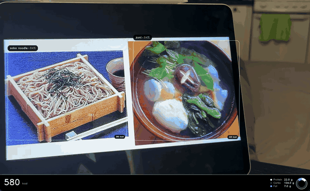
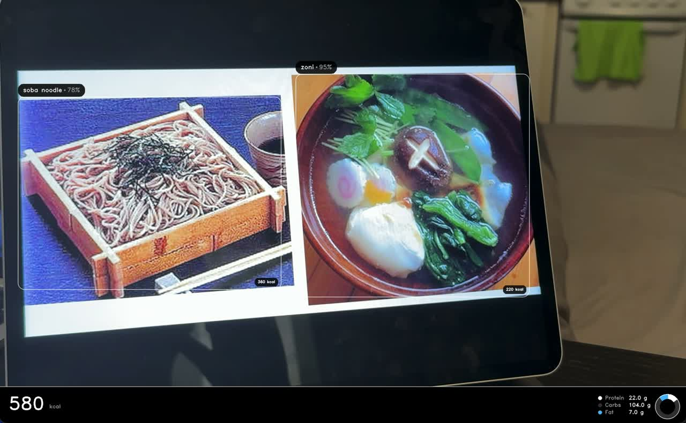
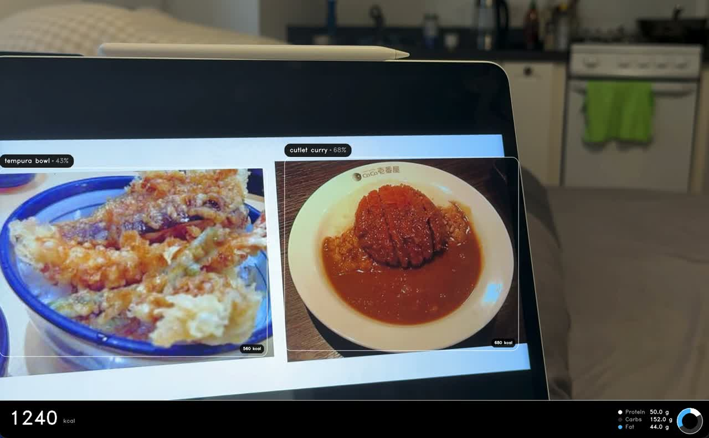
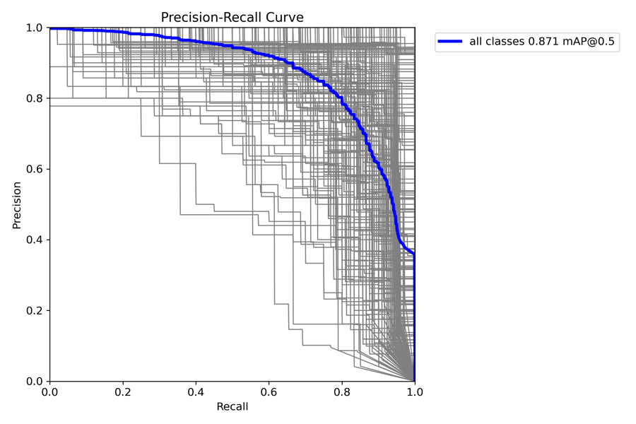
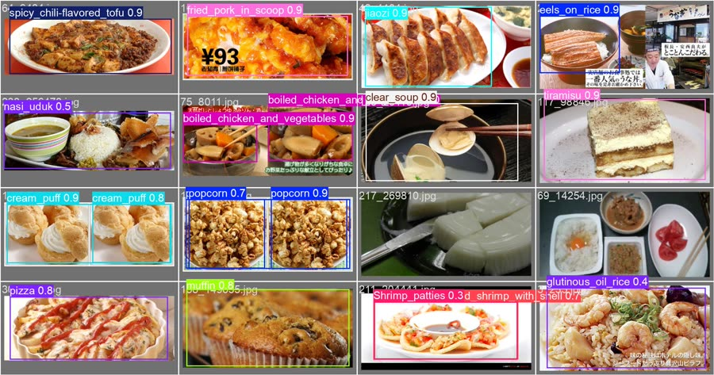

<div align="center">

# NutriScan

**Real-time food detection and nutrition estimation with YOLOv8**

Na Yin · Yu Cao · Fan Zhang



<sub>Live webcam demo. Each dish is detected and labelled with its calories; the bottom strip shows the meal total and a protein / carbs / fat breakdown.</sub>

</div>

## Overview

Keeping a food diary helps people eat better, but typing in every meal is tedious and most people stop doing it. NutriScan removes that step: point a webcam at a meal and it detects each dish, looks up its nutrition, and shows per-dish calories and meal totals on screen in real time. Everything runs locally, with no API calls.

**Highlights**

- **0.871 mAP@0.5** on UEC FOOD-256, 17.0 points above the published YOLOv5 baseline (0.701)
- Detects **multiple dishes per frame** across **194 food classes** and sums the whole meal
- **Stable output**: a 9-frame temporal vote stops labels from flickering, without leaving stale boxes behind
- **Offline** nutrition lookup from a local database covering every class

## Key Contributions

### 1. Data-centric model improvement

Instead of only scaling up the model, we audited the dataset. Of the 255 usable UEC FOOD-256 categories, 61 were unreliable: 15 had fewer than 100 training samples and 46 scored below 0.55 mAP in v1. Removing them and moving from YOLOv8n to YOLOv8s raised mAP@0.5 by 16.0 points.

| Model | Classes | Precision | Recall | F1 | mAP@0.5 | mAP@0.5:0.95 |
|-------|:-------:|:---:|:---:|:---:|:---:|:---:|
| YOLOv5 (Tan et al., published) | 256 | – | – | – | .701 | – |
| v1: YOLOv8n | 255 | .679 | .644 | .66 | .711 | .559 |
| **v2: YOLOv8s** | **194** | **.837** | **.812** | **.81** | **.871** | **.692** |

77.8% of classes reach ≥ 0.80 mAP and 91.2% reach ≥ 0.70. A second run on a Colab A100 reached 0.859, confirming the result holds across hardware.

### 2. Temporal majority voting

Frame-by-frame detectors flicker: the same bowl can read *rice → fried rice → rice* in consecutive frames. `_DetectionCache` in [`src/main.py`](src/main.py) fixes this with a two-step vote over the last 9 frames:

1. **Per-frame vote.** For each current box, find matches (IoU > 0.3) in each of the 9 previous frames. Each frame casts one vote: the label of its highest-confidence match.
2. **Label selection.** The label with the most votes wins. An odd window guarantees no ties.

Box coordinates are averaged over the winning label's history to remove jitter. Only boxes found in the current frame are drawn, so no stale boxes remain, and a new dish takes over in about 5 frames.

### 3. Multi-stage post-processing

```
Webcam → YOLOv8s → Per-class NMS (IoU 0.45) → Cross-class NMS (IoU 0.70)
       → Large-box filter (>70% of frame) → 9-frame voting → Nutrition lookup → Display
```

- **Cross-class NMS** merges overlapping detections of the same food that received different labels (e.g. `rice 24%` and `mixed rice 58%` become one box).
- **Large-box filter** drops detections covering more than 70% of the frame, which are almost always background false positives.

### 4. Local nutrition database

[`src/nutrition.py`](src/nutrition.py) maps all 194 classes to calories, protein, carbs, fat and serving size. Labels are matched exactly first, then by normalised or partial match, and per-dish values are summed into meal totals.

### 5. Interface

Rounded boxes, label capsules, calorie badges and a macronutrient donut chart, all drawn with OpenCV. The nutrition strip sits below the camera frame so it never covers the food, and labels shift automatically to avoid overlapping.

<p align="center">
  
  
</p>

## Results

<p align="center">
  
  
</p>
<p align="center"><sub>Left: v2 precision–recall curve across 194 classes. Right: v2 predictions on validation images.</sub></p>

## Getting Started

```bash
git clone https://github.com/ynbonvayage/Nutriscan.git
cd Nutriscan
pip install -r requirements.txt
```

Download `best.pt` from [Google Drive](https://drive.google.com/drive/folders/1NJWpitbZurFdss-3rMXMIePQRX00-9gJ?usp=sharing) and place it in `models/`.

```bash
python src/main.py               # run with the trained food model
python src/main.py --conf 0.25   # adjust confidence threshold
python src/main.py --demo        # preview the UI with a pretrained COCO model
```

| Option | Default | Description |
|--------|---------|-------------|
| `--model PATH` | `models/best.pt` | YOLOv8 weights |
| `--camera INDEX` | `0` | Webcam device index |
| `--conf THRESHOLD` | `0.20` | Detection confidence threshold |

To test without real food, [`src/compose_food_images.py`](src/compose_food_images.py) builds images with 2–3 dishes each from UEC FOOD-256 (samples in [`data/outputs/`](data/outputs/)). Display one on a phone or tablet and hold it up to the webcam.

## Training

| | v1 | v2 |
|---|---|---|
| Architecture | YOLOv8n (8.2M params) | YOLOv8s (11.2M params) |
| Classes | 255 | 194 |
| Hardware | Colab A100 | RTX 5070 |
| Epochs (best) | 50 (50) | 143 (98) |
| Training time | 3.25 h | 8.3 h |

- **v2 (local GPU):** `python train.py`, or [`train.ipynb`](train.ipynb) on Colab
- **v1 (Colab):** [`train_v1.ipynb`](train_v1.ipynb) with an A100 GPU

**Dataset:** [UEC FOOD-256](http://foodcam.mobi/dataset256.html). The filtered 194-class subset is defined by [`src/classes_v2.txt`](src/classes_v2.txt).

## Project Structure

```
nutriscan/
├── assets/                      <- README demo GIF, screenshots and plots
├── data/outputs/                <- Composed multi-dish demo images
├── src/
│   ├── main.py                  <- Real-time detection app
│   ├── nutrition.py             <- Local nutrition database (194 classes)
│   ├── compose_food_images.py   <- Demo test image generator
│   └── classes_v2.txt           <- 194 class labels
├── train.py                     <- v2 training script (local GPU)
├── train.ipynb                  <- v2 training notebook (Colab)
├── train_v1.ipynb               <- v1 training notebook (Colab)
└── requirements.txt
```

## Limitations and Future Work

- **Portion size:** each class uses a fixed serving size. Monocular depth estimation could estimate actual portions.
- **Closed vocabulary:** foods outside the 194 classes are missed or mislabelled. Open-vocabulary detection with an API fallback would address this.
- **Similar-looking dishes** (e.g. chicken rice vs. fried rice) can still be confused.
- **Deployment:** INT8 quantisation for mobile, and a user study comparing logging compliance against manual food diaries.

## Authors

Na Yin, Yu Cao, Fan Zhang. CS 5330 Computer Vision final project, Khoury College of Computer Sciences, Northeastern University, Spring 2026.
