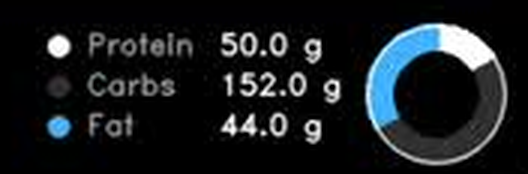
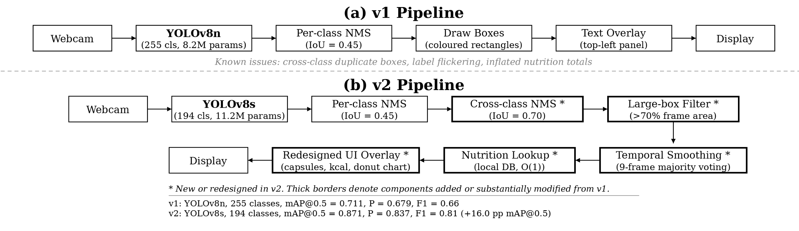
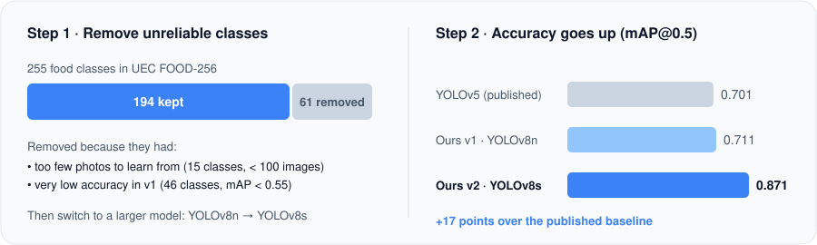
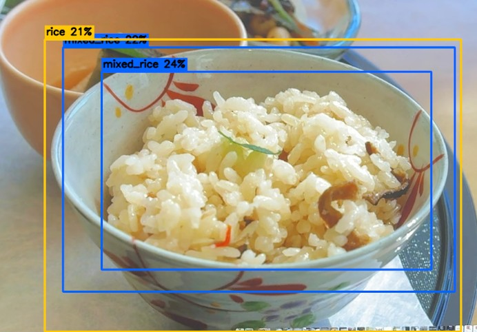
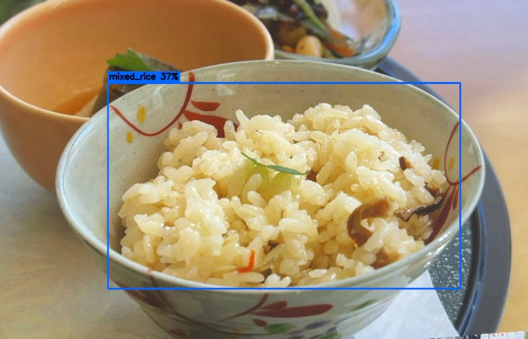
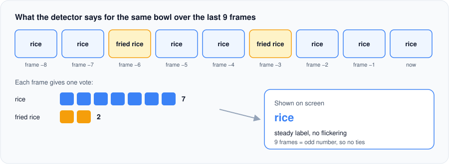

<div align="center">

# NutriScan

**Real-time food detection and nutrition estimation with YOLOv8**

Na Yin · Yu Cao · Fan Zhang


<sub>Live webcam demo. Each dish is detected and labelled with its calories; the bottom strip shows the meal total and a protein / carbs / fat breakdown.</sub>

</div>

## Screenshots

The GIF above is compressed, so here are full-resolution frames from the same session.

<p align="center">
  
</p>
<p align="center"><sub><b>Two dishes, 580 kcal.</b> Soba noodle (360 kcal) and zoni (220 kcal), each with a label capsule showing class and confidence, and a calorie badge in the corner of its box.</sub></p>

<p align="center">
  
</p>
<p align="center"><sub><b>Two dishes, 1240 kcal.</b> Tempura bowl (560 kcal) and cutlet curry (680 kcal). The strip below the camera frame shows the meal total on the left and the macro breakdown on the right.</sub></p>

<p align="center">
  
</p>
<p align="center"><sub>Close-up of the macro panel: grams of protein, carbs and fat, with a donut chart of their proportions.</sub></p>

## Overview

Keeping a food diary helps people eat better, but typing in every meal is tedious and most people stop doing it. NutriScan removes that step: point a webcam at a meal and it detects each dish, looks up its nutrition, and shows per-dish calories and meal totals on screen in real time. Everything runs locally, with no API calls.

**Highlights**

- **0.871 mAP@0.5** on UEC FOOD-256, 17.0 points above the published YOLOv5 baseline (0.701)
- Detects **multiple dishes per frame** across **194 food classes** and sums the whole meal
- **Stable output**: a 9-frame temporal vote stops labels from flickering, without leaving stale boxes behind
- **Offline** nutrition lookup from a local database covering every class

## How It Works

Every webcam frame goes through the same short pipeline. The model finds the dishes, three clean-up steps fix its typical mistakes, and the nutrition database turns labels into numbers.

<p align="center">
  
</p>
<p align="center"><sub>Our first version (top) against the final version (bottom). Thick borders mark the steps we added in v2. Figure from our project paper.</sub></p>

Below are the four ideas that make the difference, each with the problem it solves.

### 1. Better data beats a bigger model

**Problem:** some food classes had very few photos, or looked so similar to others that the model almost never got them right. They dragged down the whole model.

**Fix:** we removed the 61 unreliable classes, kept 194, and moved to a slightly larger model.

<p align="center">
  
</p>

<details>
<summary>Full numbers</summary>

| Model | Classes | Precision | Recall | F1 | mAP@0.5 | mAP@0.5:0.95 |
|-------|:-------:|:---:|:---:|:---:|:---:|:---:|
| YOLOv5 (Tan et al., published) | 256 | – | – | – | .701 | – |
| v1: YOLOv8n | 255 | .679 | .644 | .66 | .711 | .559 |
| **v2: YOLOv8s** | **194** | **.837** | **.812** | **.81** | **.871** | **.692** |

Removed classes: 15 had fewer than 100 training images, and 46 scored below 0.55 mAP in v1. After the change, 77.8% of classes reach ≥ 0.80 mAP and 91.2% reach ≥ 0.70. A second run on a Colab A100 reached 0.859, so the gain is not tied to one machine.

</details>

### 2. One dish, one box

**Problem:** the model sometimes puts several boxes with different labels on the same bowl, for example *rice* and *mixed rice*. Each box is counted, so the calories are counted two or three times.

**Fix:** when two boxes overlap heavily, keep only the most confident one, whatever its label. We also drop any box that covers more than 70% of the frame, because those are almost always the table or background.

<p align="center">
  
  
</p>
<p align="center"><sub>Left: v1 draws three boxes on one bowl of rice and reports 390 kcal. Right: v2 keeps one box and counts the dish once (195 kcal).</sub></p>

<details>
<summary>Technical details</summary>

YOLO's own suppression only compares boxes of the same class. We run per-class NMS (IoU 0.45) and then a cross-class NMS (IoU 0.70) in [`src/main.py`](src/main.py), followed by the large-box filter.

</details>

### 3. Labels that don't flicker

**Problem:** the detector looks at each frame on its own, so the label on a bowl can jump between *rice* and *fried rice* several times per second.

**Fix:** remember the last 9 frames and let each one vote. The label with the most votes is the one shown.

<p align="center">
  
</p>

<details>
<summary>Technical details</summary>

`_DetectionCache` in [`src/main.py`](src/main.py) matches each current box to boxes in the previous frames (IoU > 0.3). Each frame votes with the label of its most confident match, and the box position is averaged over the winning label's history to stop it jittering. Only dishes found in the current frame are drawn, so a removed plate disappears at once, and a new dish takes over in about 5 frames.

</details>

### 4. From labels to calories, offline

[`src/nutrition.py`](src/nutrition.py) stores calories, protein, carbs, fat and serving size for all 194 classes. Each detected dish is looked up (exact name first, then a looser match) and the values are added up for the whole meal. No internet or API is needed.

The results are drawn on screen with OpenCV: a label and calorie badge for each dish, and a strip below the camera view with the meal total and a protein / carbs / fat donut chart. The strip sits under the video, so it never covers the food. See [Screenshots](#screenshots).

## Results

<p align="center">
  
  
</p>
<p align="center"><sub>Left: v2 precision–recall curve across 194 classes. Right: v2 predictions on validation images.</sub></p>

## Getting Started

```bash
git clone https://github.com/ynbonvayage/Nutriscan.git
cd Nutriscan
pip install -r requirements.txt
```

Download `best.pt` from [Google Drive](https://drive.google.com/drive/folders/1NJWpitbZurFdss-3rMXMIePQRX00-9gJ?usp=sharing) and place it in `models/`.

```bash
python src/main.py               # run with the trained food model
python src/main.py --conf 0.25   # adjust confidence threshold
python src/main.py --demo        # preview the UI with a pretrained COCO model
```

| Option | Default | Description |
|--------|---------|-------------|
| `--model PATH` | `models/best.pt` | YOLOv8 weights |
| `--camera INDEX` | `0` | Webcam device index |
| `--conf THRESHOLD` | `0.20` | Detection confidence threshold |

To test without real food, [`src/compose_food_images.py`](src/compose_food_images.py) builds images with 2–3 dishes each from UEC FOOD-256 (samples in [`data/outputs/`](data/outputs/)). Display one on a phone or tablet and hold it up to the webcam.

## Training

| | v1 | v2 |
|---|---|---|
| Architecture | YOLOv8n (8.2M params) | YOLOv8s (11.2M params) |
| Classes | 255 | 194 |
| Hardware | Colab A100 | RTX 5070 |
| Epochs (best) | 50 (50) | 143 (98) |
| Training time | 3.25 h | 8.3 h |

- **v2 (local GPU):** `python train.py`, or [`train.ipynb`](train.ipynb) on Colab
- **v1 (Colab):** [`train_v1.ipynb`](train_v1.ipynb) with an A100 GPU

**Dataset:** [UEC FOOD-256](http://foodcam.mobi/dataset256.html). The filtered 194-class subset is defined by [`src/classes_v2.txt`](src/classes_v2.txt).

## Project Structure

```
nutriscan/
├── assets/                      <- README demo GIF, screenshots and plots
│   └── diagrams/                <- Explainer figures used in the README
├── data/outputs/                <- Composed multi-dish demo images
├── src/
│   ├── main.py                  <- Real-time detection app
│   ├── nutrition.py             <- Local nutrition database (194 classes)
│   ├── compose_food_images.py   <- Demo test image generator
│   └── classes_v2.txt           <- 194 class labels
├── train.py                     <- v2 training script (local GPU)
├── train.ipynb                  <- v2 training notebook (Colab)
├── train_v1.ipynb               <- v1 training notebook (Colab)
└── requirements.txt
```

## Limitations and Future Work

- **Portion size:** each class uses a fixed serving size. Monocular depth estimation could estimate actual portions.
- **Closed vocabulary:** foods outside the 194 classes are missed or mislabelled. Open-vocabulary detection with an API fallback would address this.
- **Similar-looking dishes** (e.g. chicken rice vs. fried rice) can still be confused.
- **Deployment:** INT8 quantisation for mobile, and a user study comparing logging compliance against manual food diaries.

## Authors

Na Yin, Yu Cao, Fan Zhang. CS 5330 Computer Vision final project, Khoury College of Computer Sciences, Northeastern University, Spring 2026.
